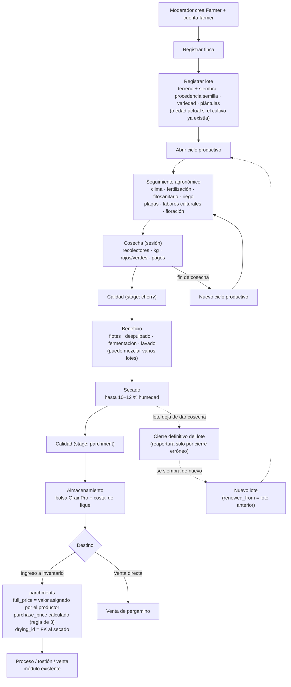
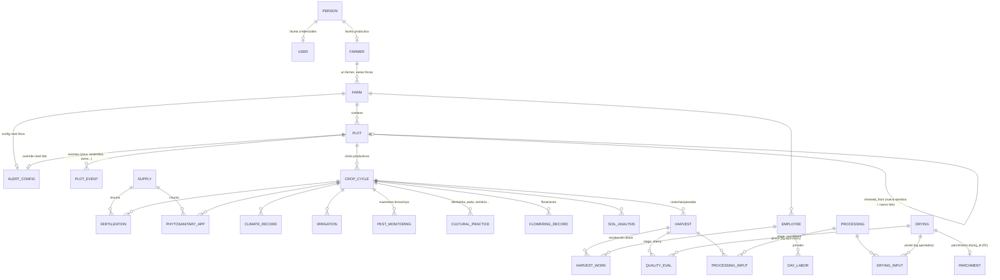

# Farm Operations — Arquitectura y Planeación

> Documento maestro del módulo de cultivo y trazabilidad.
> Estado: **en planeación** — no se ha escrito código.
> Última actualización: 2026-08-06

---

## 1. Contexto y objetivo

Shaya ya cuenta con un sistema funcional de inventario, procesamiento y ventas
(café pergamino seco → tostado → venta). Ese sistema arranca en el momento en
que el pergamino seco **entra al inventario**; todo lo anterior (cultivo,
cosecha, beneficio, secado) hoy no existe digitalmente.

**Farm Operations** cubre ese vacío: es el módulo de trazabilidad agrícola que
registra el ciclo completo desde la siembra hasta que el café seco sale hacia
el inventario. El objetivo central es que la cadena de relaciones nunca se
rompa, para poder responder:

> ¿De qué finca y lote salió este café que vendí, qué labores recibió,
> cuándo se cosechó, cómo se benefició y secó, y qué calidad tuvo?

Además, los datos capturados alimentarán un componente de **machine learning**
que proyecta la calidad del café en función de las variables registradas
durante la vida del lote.

## 2. Alcance

### Incluye (v1)

- Administración de fincas y lotes (multi-finca, multi-usuario).
- Ciclo de vida del lote: cierre definitivo al agotarse, corrección de cierres
  erróneos, nueva siembra como lote nuevo enlazado al anterior.
- Ciclos de cultivo por lote (una siembra → varias cosechas/ciclos).
- Seguimiento agronómico: fertilización, manejo fitosanitario, riego, labores
  culturales, monitoreo de plagas y enfermedades, floración, análisis de
  suelo, registros climáticos manuales.
- Catálogo de insumos agrícolas (fertilizantes, fitosanitarios, herbicidas…).
- Cosechas como "sesiones" (análogo al módulo de ferias): dentro de cada
  cosecha se registran recolectores, cantidades, composición (rojos/verdes),
  precios y pagos.
- Módulo de empleados y jornales (pago por kg recogido y por día trabajado).
- Evaluación de calidad (múltiples variables: puntaje 0–100, % defectos, etc.).
- Beneficio completo: selección de flotes, despulpado, fermentación, lavado.
- Secado y almacenamiento (empaque).
- Salida del producto terminado hacia `parchments` (inventario).
- Dashboards con alertas: uno administrativo (todas las fincas) y uno por
  usuario (sus fincas).

### No incluye (v1)

- Integración con APIs de clima (registro manual; las fincas no tienen
  dispositivos de medición confiables).
- Modelos predictivos entrenados con datos reales (se usa generador de datos
  ficticios; ver §9).
- App móvil / captura offline.

## 3. Decisiones de arquitectura

| # | Decisión | Racional |
|---|----------|----------|
| A1 | **Monolito modular**: el módulo vive dentro de `backend/`, misma base de datos, misma cadena de Alembic. | La trazabilidad exige FKs reales hacia `parchments`/`inventories` y transacciones atómicas (cerrar secado → crear inventario). Separar en microservicio rompería integridad referencial y obligaría a sagas/eventos sin beneficio real. |
| A2 | **Paquete de dominio autocontenido**: `app/farm_operations/` con `models/`, `schemas/`, `services/`, `api/v1/`, `ml/`, `docs/`. Se monta con una sola línea en `api_v1.py` bajo el prefijo `/api/v1/farm`. | Mantiene versión y dominio como ejes separados (evita `farm_operations_api_v1`). El módulo se lee y se defiende como unidad. |
| B1 | **ML dentro del monolito** (`app/farm_operations/ml/`). Entrenamiento **offline** vía script en `backend/scripts/` que produce un artefacto versionado (`.joblib`); la API solo carga el artefacto y hace `predict`. | Mismo patrón de "lectura sin efectos" que el chatbot, pero sin justificación para otro contenedor. Si algún día se necesita GPU o entrenamiento online, extraerlo es mover una carpeta. |
| C1 | La producción propia entra a `parchments` **por el mismo flujo de compra actual, sin caso especial**, con un **valor asignado por el usuario**: al ingresar el café propio se indica `full_price` (precio por carga de 125 kg que el productor decide — el precio base del mercado a esa fecha como mínimo, o más si valora su café por encima) y `purchase_price` se calcula con la regla de 3 vigente (`kg × full_price / 125`). Los campos conservan exactamente su semántica actual. | "Tal cual como funciona actualmente": `full_price` = precio de la carga, `purchase_price` = total prorrateado por los kg del lote ([service.py `calculate_purchase_price`](../../api/api_v1/inventory/service.py)). Así el café propio queda valorizado en inventario (costeo y márgenes reales). El origen (producido vs comprado) se distingue por la relación con el secado (`origin_batch` FK), no por el precio. |
| C2 | La trazabilidad hacia inventario va por una **columna nueva** `parchments.drying_id` (FK al secado, nullable, unique). `origin_batch` **se conserva** como texto libre para el código de lote del café comprado y los datos históricos. | Es el eslabón que une los dos dominios. Convertir `origin_batch` en FK rompería los valores históricos importados de Excel y dejaría las compras a terceros sin campo de código. (Refinado en modelo-datos R4.) |
| C3 | Conviven ambos orígenes de pergamino: **producido** (sale de Farm Operations) y **comprado** a terceros (flujo actual sin trazabilidad de cultivo). | El pergamino seco además puede venderse directamente sin pasar a proceso. |
| C4 | Toda `Farm` **se enlaza a un `Farmer` existente** (`farmer_id` obligatorio): primero se crea el caficultor, luego sus fincas. Un `Farmer` puede tener **varias fincas**. La producción propia usa el `Farmer` **Shaya** (dato semilla). | Reutiliza la entidad existente y resuelve `parchments.farmer_id` sin cambios: el pergamino producido en finca propia sale con el farmer Shaya. |
| D1 | Jerarquía **Finca → Lote**: la finca contiene lotes; cada lote representa **una única siembra** sobre un terreno (variedad, fecha de siembra, procedencia de semilla, área). | Refleja cómo piensa el caficultor: "cada lote es como una variedad". |
| D2 | **Ciclo de vida del lote**: cuando un lote **deja de dar cosecha se cierra definitivamente**. La **reapertura solo existe para corregir un cierre hecho por error** (el usuario cerró sin querer), no para revivir lotes agotados. Si el terreno se siembra de nuevo, **se crea un lote nuevo**, con referencia opcional al anterior (`renewed_from_plot_id`) para conservar la historia del terreno. En el **primer registro** de un lote ya cultivado se puede indicar la **edad actual del cultivo** (fecha de siembra estimada o edad en años). | Soporta onboarding de fincas con cultivos ya establecidos y el ciclo real: siembra → producción → agotamiento → cierre → nueva siembra = nuevo lote. |
| D3 | Cada lote tiene **varios ciclos productivos** (`CropCycle`): al terminar una cosecha empieza un ciclo nuevo sobre la misma siembra. | Comparar ciclos del mismo lote a lo largo del tiempo es insumo clave del ML. |
| D4 | La **renovación por zoca es un evento** sobre el lote, no un lote nuevo (el cultivo sigue siendo el mismo, rebrotado). Principio general: **todo cambio relevante queda como evento** con fecha (zoca, resiembra parcial, cambio de sombrío, cierre, reapertura por corrección). | La historia se conserva. La "edad efectiva" (feature del ML) se calcula desde la siembra o desde la última zoca. |
| D5 | **Una sola tabla de evaluación de calidad** con campo `stage` (`cherry` en cosecha, `parchment` post-secado) y validación por etapa. | Ver análisis en §5.1: con dos etapas y columnas mayormente compartidas, una tabla es mejor para consultas, API y dataset del ML; separar solo pagaría si los conjuntos de columnas fueran disjuntos. |
| D6 | **Procedencia de la semilla** se registra en el lote: dónde se compró/obtuvo, proveedor, fecha, variedad (la variedad del lote sale de aquí), cantidad de plántulas. | Trazabilidad completa "desde la semilla" y datos de partida del cultivo. |
| D7 | **Catálogo de insumos** (`Supply`): tabla propia con nombre, tipo (fertilizante, fitosanitario, herbicida, enmienda, otro), unidad y detalle — las labores referencian el insumo por FK, no por texto libre. | Texto libre imposibilita agrupar por producto/tipo (features del ML, costos por insumo). Los usuarios pueden crear insumos al vuelo desde el formulario. Nombre distinto de `Product` (existente, café procesado) para evitar colisión. |
| E1 | **Permisos**: el caficultor ve y administra únicamente sus fincas; los administradores ven todo. | Los caficultores registran sus propios datos y quedan en el sistema de Shaya. |
| E2 | **Sin autoregistro**: las cuentas de caficultores las crea un moderador/administrador y les entrega credenciales. | Evita registro público abierto y moderación de cuentas falsas. |
| E3 | **Nuevo rol `farmer`** en `users.role` (hoy: admin, user). El caficultor con acceso es **una `Person` con dos facetas**: un registro en `farmers` (catálogo productivo) y un registro en `users` con rol `farmer` (credenciales), ambos apuntando al mismo `person_id`. | `Person` ya es el eje del sistema: `User`, `Farmer` y `Customer` son facetas 1:1 de `persons`. No se duplica ningún dato personal. Un `Farmer` sin cuenta (proveedores actuales) simplemente no tiene registro en `users`. Ver §7.1. |
| F1 | **Unidades: kg en todo el sistema** (almacenamiento y cálculo). La UI acepta entrada en **arrobas (12,5 kg) y cargas (125 kg)** y convierte automáticamente a kg antes de guardar. | Estándar único en la base de datos evita errores de conversión; la entrada en arrobas/cargas es como piensa el caficultor. La conversión es fija y solo de presentación. |
| F2 | **Rendimientos calculados, no configurados**: el rendimiento (kg cereza → kg pergamino seco, etc.) se calcula siempre a partir de los datos reales registrados en cada etapa, y se recalcula cuando entran datos nuevos. No hay factores de rendimiento "esperado" configurables. | La referencia para comparar un lote/cosecha es el **histórico calculado** de la misma finca o lote, no un parámetro manual. |
| G1 | **Alertas y recordatorios configurables en dos niveles**: por **finca** (aplica a todos sus lotes) y por **lote** (sobreescribe a la finca). Resolución: lote → finca → default del sistema (literatura). Todos los parámetros son configurables: frecuencia de riego, fertilización, cosecha, días de secado, rango de humedad, etc. | UX: quien tiene 20 lotes configura una vez a nivel finca y solo ajusta los lotes que difieren. Cada lote tiene condiciones distintas (variedad, altitud, edad); un umbral global no sirve. |

## 4. Flujo de negocio



## 5. Modelo de dominio (borrador conceptual)

> Nombres tentativos en inglés, consistentes con los modelos existentes
> (`Farmer`, `Parchment`). Los campos definitivos se detallarán en el
> documento de modelo de datos.



Entidades principales:

| Entidad | Rol | Notas |
|---|---|---|
| `Farm` | Finca | `farmer_id` obligatorio (el `Farmer` se crea primero; uno puede tener varias fincas), ubicación (vereda, municipio), altitud, área total. |
| `Plot` | Lote | Terreno + su única siembra. Terreno: nombre, área, pendiente, **tipo de suelo**, ubicación dentro de la finca. Siembra: **procedencia de la semilla** (proveedor/almacén, lugar de compra, fecha, costo), **variedad** (sale de la semilla), **cantidad de plántulas**, densidad (distancia de siembra), **tipo de sombrío**, fecha de siembra **o edad actual del cultivo** (onboarding de lotes ya establecidos, D2). Estado: `active` / `closed` — cierre **definitivo** cuando deja de dar cosecha; la reapertura solo corrige un cierre por error. Nueva siembra = **lote nuevo** con `renewed_from_plot_id` opcional al anterior (historia del terreno). |
| `PlotEvent` | Evento | Historial fechado sobre el lote: renovación por zoca, resiembra parcial, cambio de sombrío, cierre, reapertura por corrección. La edad efectiva se calcula desde siembra o última zoca. |
| `AlertConfig` | Parámetros de alerta | Dos niveles: finca (todos sus lotes) y lote (override). Resolución lote → finca → default (G1). |
| `CropCycle` | Ciclo productivo | Ventana temporal entre el inicio post-cosecha y el fin de la cosecha siguiente. Todas las labores y cosechas cuelgan de aquí. |
| `ClimateRecord` | Registro climático manual | Lluvia (mm), temperatura mín/máx, observaciones. Por finca o lote, fecha. |
| `Supply` | Catálogo de insumos | Nombre, tipo (`fertilizer`, `phytosanitary`, `herbicide`, `amendment`, `other`), unidad, ingrediente activo/composición opcional. Referenciado por FK desde las labores (D7). |
| `Fertilization` | Fertilización | `supply_id`, dosis (kg o g/árbol), método (edáfica/foliar), fecha, costo, empleados. |
| `PhytosanitaryApp` | Aplicación fitosanitaria | `supply_id`, objetivo (broca, roya, maleza…), dosis, fecha, costo, empleados. |
| `Irrigation` | Riego | Fecha, duración/volumen, método, observaciones. |
| `PestMonitoring` | Monitoreo de plagas/enfermedades | Muestreo fechado: % infestación de **broca**, % incidencia de **roya**, otras (cochinilla, minador, mal rosado), nivel de severidad, observaciones. |
| `CulturalPractice` | Labores culturales | Tipo (`weeding` deshierba/plateo, `pruning` poda, `shade_regulation` regulación de sombrío, `amendment` encalado, otra), fecha, costo, empleados. |
| `FloweringRecord` | Floración | Fecha e intensidad de cada floración. Clave para proyectar cosecha (~32 semanas después) y ventanas de control de broca. |
| `SoilAnalysis` | Análisis de suelo | Fecha, pH, materia orgánica, N-P-K, textura, laboratorio. Opcional pero muy valioso para el ML. |
| `Harvest` | Cosecha (sesión) | Análoga a una feria: se abre, se registran datos diarios, se cierra. Nº de pasada, totales de kg cereza, % rojos/maduros, % verdes, % sobremaduros/secos, % brocados, precio por kg. |
| `HarvestWork` | Recolección diaria | Empleado, fecha, kg recogidos, tarifa, valor a pagar, estado de pago. |
| `Employee` / `DayLabor` | Empleados y jornales | Datos del trabajador (por finca); jornales para labores no-cosecha (día trabajado, valor, labor asociada). |
| `QualityEval` | Evaluación de calidad | **Una sola tabla** con `stage` (`cherry` / `parchment`) — ver §5.1. |
| `Processing` | Beneficio | Etapas y variables en §5.2. Recibe N cosechas vía `ProcessingInput` (kg por origen). |
| `Drying` | Secado | Variables en §5.2. Recibe N beneficios vía `DryingInput`. Incluye datos de **almacenamiento/empaque** al cierre. |
| → `Parchment` | Salida a inventario | Al cerrar el secado con destino inventario se crea el registro en `parchments` en la misma transacción: `drying_id` = FK al secado, `full_price` = valor por carga asignado por el productor y `purchase_price` calculado por regla de 3 (C1). |

### 5.1 Calidad: una tabla con `stage` (análisis)

La calidad se mide en dos momentos con variables que **se superponen en gran
parte**:

| Variable | `cherry` (en cosecha) | `parchment` (post-secado) |
|---|---|---|
| % frutos maduros/rojos | ✔ | — |
| % verdes / sobremaduros | ✔ | — |
| % brocados | ✔ | ✔ (grano brocado) |
| Humedad | — | ✔ (10–12 %) |
| % defectos / almendra sana | ✔ (flotes estimados) | ✔ |
| Factor de rendimiento en trilla | — | ✔ |
| Puntaje 0–100 (estilo SCA) | — | ✔ (si se cata) |
| Observaciones | ✔ | ✔ |

Opciones evaluadas:

1. **Una tabla con `stage` + columnas anulables** (elegida). Las columnas que
   no aplican a la etapa van en `NULL` (costo ~cero en Postgres: bitmap de
   nulls). Se valida por `CHECK` o en el servicio qué campos exige cada
   etapa. Una sola API, una sola query para el dataset del ML, un solo
   formulario con secciones condicionales.
2. **Dos tablas** (`cherry_quality_evals`, `parchment_quality_evals`).
   Se justificaría si los conjuntos de columnas fueran disjuntos y las reglas
   de negocio divergieran fuerte. No es el caso: duplicaría API, joins y
   mantenimiento sin ganancia de rendimiento medible a esta escala
   (miles de filas, no millones).
3. **EAV** (tabla de pares atributo-valor). Descartada: destruye tipado,
   constraints y rendimiento de consulta.

A la escala de este sistema el rendimiento entre (1) y (2) es indistinguible;
la diferencia real es mantenimiento, y ahí gana (1). Si a futuro una etapa
creciera mucho (p. ej. catación formal con 10+ atributos SCA), esa parte se
extrae a una tabla satélite (`cupping_details`) unida 1:1 — sin romper nada.

### 5.2 Variables de beneficio, secado y almacenamiento

Proceso real (húmedo) que el modelo debe capturar:

| Etapa | Entidad | Variables |
|---|---|---|
| 1. Selección de flotes | `Processing` | kg cereza que entran (suma de la pivote), kg de flotes retirados, método (tanque/zaranda). |
| 2. Despulpado | `Processing` | Fecha y hora de despulpado, horas transcurridas desde la recolección (se calcula), observaciones (calibración de la despulpadora). |
| 3. Fermentación | `Processing` | Inicio y fin (fecha-hora), horas totales (calculado), método (tanque, seco, con agua), criterio de punto: **el fermaestro indica el momento de lavar** — se registra quién decidió y cómo (prueba de tacto/palote), temperatura ambiente opcional. |
| 4. Lavado | `Processing` | Nº de lavadas/aguas, kg de café lavado (baba retirada), observaciones. |
| 5. Secado | `Drying` | Método (elba, marquesina, patio, silo mecánico), fecha inicio y fin, días (calculado), **humedad final (se recoge entre 10 % y 12 %)**, mediciones intermedias de humedad opcionales, kg de pergamino seco de salida. |
| 6. Almacenamiento | `Drying` (cierre) | Tipo de empaque (**bolsa GrainPro dentro de costal de fique** como default), nº de bultos, fecha de empaque, bodega/lugar, destino (inventario / venta directa / guarda en finca). |

## 6. Trazabilidad

La cadena completa que el sistema debe poder recorrer en ambas direcciones:

```
Venta → DetailSale → Product/Inventory → Parchment
      → Drying (parchments.drying_id FK)
      → DryingInput → Processing
      → ProcessingInput → Harvest
      → CropCycle → Plot → Farm → Farmer/Person
```

Con las labores (`Fertilization`, `PhytosanitaryApp`, `Irrigation`,
`PestMonitoring`, `CulturalPractice`, `FloweringRecord`, `ClimateRecord`,
`SoilAnalysis`) colgando del `CropCycle` correspondiente.

Reglas para no romper la cadena:

1. Ningún eslabón se borra si tiene descendencia (`ondelete=RESTRICT`),
   siguiendo el patrón ya usado en costos de producción.
2. Las mezclas (N:M) guardan **kg aportados por origen**: la trazabilidad de
   un secado mezclado se expresa como composición porcentual, no se pierde.
3. La creación del `Parchment` desde secado es **atómica** (misma transacción).

## 7. Roles, permisos y dashboards

### 7.1 Roles y el vínculo Farmer ↔ User

`Person` ya es el eje del sistema: `users.person_id`, `farmers.person_id` y
`customers.person_id` son facetas 1:1 de la misma persona. El caficultor con
acceso al sistema es **una sola `Person` con dos facetas**:

```
persons (datos personales: nombre, documento, teléfono, email)
   ├── farmers  (faceta productiva: sus fincas, su café)   ← ya existe
   └── users    (faceta credenciales: username, password, role='farmer')
```

- No se duplica ningún dato personal: nombre, documento y contacto viven una
  sola vez en `persons`.
- Un `Farmer` **sin** cuenta (los proveedores actuales) simplemente no tiene
  registro en `users` — todo lo existente sigue funcionando igual.
- Flujo del moderador al dar acceso: si el farmer ya existe, se crea solo el
  `User` con rol `farmer` apuntando al mismo `person_id`; si no existe, se
  crea `Person` + `Farmer` + `User` en una sola operación.
- La resolución "¿qué fincas puede ver este usuario?" es:
  `user.person_id → farmer → farms`.

| Rol (`users.role`) | Alcance |
|---|---|
| `admin` | Visibilidad y gestión total sobre todas las fincas registradas. Crea cuentas de caficultores (E2). |
| `user` | Personal de Shaya: módulos de inventario/ventas según lo actual. |
| `farmer` (**nuevo**) | CRUD sobre **sus** fincas, lotes, siembras, ciclos, cosechas, empleados. No ve datos de otros. |

Todo endpoint del módulo filtra por propiedad de la finca
(`farm.farmer_id → farmer.person_id = current_user.person_id`); el detalle
(dependencia común de FastAPI) se define en el documento técnico.

Las cuentas de caficultor **no tienen autoregistro**: las crea un
moderador/administrador de Shaya y les entrega las credenciales (E2).

### 7.2 Dashboards

Requisito del usuario: "muy muy funcional para ese proceso". Dos vistas:

**Dashboard administrador** (todas las fincas):
- Fincas y lotes activos, área total sembrada por variedad.
- Producción por periodo (kg cereza cosechada, kg pergamino producido).
- Rendimientos comparados entre fincas/lotes (kg cereza → kg pergamino),
  calculados desde los datos reales y contrastados contra el histórico de la
  misma finca/lote (decisión F2).
- Café en proceso: qué hay en beneficio, qué hay en secado, hace cuántos días.
- Calidad: distribución de puntajes y defectos por finca/lote/variedad.
- Sanidad: mapa de infestación de broca/roya por finca (últimos muestreos).
- Costos de cosecha (pagos a recolectores, jornales).

**Dashboard usuario farmer** (sus fincas): misma información restringida a sus
datos, más el estado de sus ciclos activos y sus recordatorios.

**Alertas y recordatorios** (ambos dashboards, según alcance):
- Recordatorios de labores según frecuencia configurada: riego, fertilización,
  manejo fitosanitario, deshierba, próxima pasada de cosecha.
- Proyección de cosecha por floración registrada (~32 semanas).
- Muestreo de broca por encima del umbral (default literatura: >2 %).
- Secado abierto hace más de N días.
- Cosecha cerrada sin evaluación de calidad.
- Ciclo activo sin registros de labores hace más de N días.
- Humedad final fuera de rango al cerrar secado (estándar: 10–12 %).
- Fermentación por fuera del rango de horas configurado.
- Pagos de recolección pendientes.

Configuración en dos niveles (G1): **finca** (aplica a todos sus lotes) y
**lote** (sobreescribe). Resolución: lote → finca → default del sistema.
El usuario con 20 lotes configura una vez a nivel finca y ajusta solo los
lotes que difieren.

**Principio: el sistema informa, nunca obliga.** Las labores (fertilización,
riego, fitosanitarios…) se registran cuando el farmer las haga, si las hace:
no hay frecuencias impuestas, pasos bloqueados ni registros obligatorios de
labores. Las alertas y recordatorios son **solo notificaciones** calculadas a
partir de lo configurado y de lo registrado; ignorarlas no impide ninguna
operación. Lo único que el sistema exige son los datos mínimos que sostienen
la trazabilidad (pesos y vínculos entre etapas).

## 8. Integración con el módulo de inventario existente

| Punto de contacto | Cambio requerido |
|---|---|
| `parchments.drying_id` | **Columna nueva**: FK hacia el secado, nullable (el café comprado no tiene secado registrado), unique. `origin_batch` se conserva como texto libre para compras y datos históricos (C2/R4). |
| `parchments.purchase_price`, `full_price` | Sin cambio de schema ni de lógica: la producción propia entra con el `full_price` (precio por carga) que el productor asigne — precio base del mercado o superior — y `purchase_price` se calcula con la regla de 3 actual. Semántica intacta (C1). |
| `parchments.farmer_id` | Sin cambio de schema: toda `Farm` pertenece a un `Farmer` (C4). La producción propia entra con el `Farmer` **Shaya** (dato semilla); la de fincas de terceros, con su farmer correspondiente. |
| `users.role` | Nuevo valor `farmer` (E3). Sin cambio de schema (columna `String`). |
| Venta directa de pergamino | El pergamino producido puede venderse sin entrar a proceso — flujo ya soportado por inventario/ventas una vez el registro existe en `parchments`. |

El resto del módulo de inventario no se toca.

## 9. Machine Learning — proyección de calidad

### Objetivo

Predecir la **calidad esperada** del café de un lote en función de los
cuidados y variables registradas durante su ciclo (labores, clima, sanidad,
cosecha, beneficio, secado).

### 9.1 Variable objetivo (qué es "calidad")

Decisión: la calidad se mide con **múltiples variables**, no una sola:

- Puntaje total 0–100 (estilo SCA).
- % de defectos / % almendra sana.
- Factor de rendimiento en trilla (kg pergamino para 70 kg de excelso).
- Humedad final.
- (Extensible: notas por atributo — fragancia, acidez, cuerpo — vía tabla
  satélite si se llega a catar formalmente, ver §5.1.)

Implicación para el ML: el problema es **regresión multi-salida** (o un modelo
por variable objetivo). Implicación para el schema: `QualityEval` debe
almacenar todas estas variables desde el día uno, aunque lleguen vacías.

### 9.2 Features candidatas (esto define qué tablas/campos son obligatorios)

| Grupo | Variables | Fuente |
|---|---|---|
| Lote | variedad, altitud, área, edad efectiva del cultivo (desde siembra o última zoca), densidad, tipo de sombrío, tipo de suelo | `Plot` / `PlotEvent` |
| Suelo | pH, materia orgánica, N-P-K (último análisis) | `SoilAnalysis` |
| Clima | lluvia acumulada y temperatura promedio por etapa del ciclo | `ClimateRecord` |
| Nutrición | nº de fertilizaciones, tipo de insumo, dosis, momento del ciclo | `Fertilization` + `Supply` |
| Sanidad | % infestación broca, % incidencia roya (muestreos), nº de aplicaciones fitosanitarias y momento | `PestMonitoring`, `PhytosanitaryApp` |
| Manejo | nº de deshierbas, podas, regulaciones de sombrío en el ciclo | `CulturalPractice` |
| Floración | fechas e intensidad → días floración-cosecha | `FloweringRecord` |
| Cosecha | % maduros vs verdes vs sobremaduros, % brocados, nº de pasada, kg | `Harvest` |
| Beneficio | % de flotes, horas entre recolección y despulpado, horas de fermentación, método | `Processing` |
| Secado | método, días de secado, humedad final | `Drying` |

> Principio de diseño: **cada feature del modelo debe tener columna en el
> schema**. Si una variable no se puede capturar, no puede ser feature.

### 9.3 Datos ficticios y honestidad metodológica

No hay datos reales disponibles todavía. El plan:

1. **Generador de datos sintéticos** parametrizado con relaciones tomadas de
   literatura agronómica (Cenicafé, protocolo SCA): p. ej. mayor % de verdes
   → más defectos; broca alta → más grano brocado; fermentación excesiva →
   menor puntaje; secado fuera de rango → penalización.
2. El modelo se entrena y evalúa sobre esos datos.
3. **Alcance declarado del componente**: las métricas validan el *pipeline*
   completo (captura → features → entrenamiento → serving → recomendación en
   UI), **no** la validez agronómica de la predicción. Un modelo entrenado
   sobre un generador solo puede recuperar las reglas del generador; esto se
   declara explícitamente en la documentación y en la UI.
4. Cuando existan datos reales, reentrenar = ejecutar el script.

### 9.4 Arquitectura del componente

```
backend/scripts/farm_ml/
    generate_synthetic.py    # genera dataset ficticio parametrizado
    train.py                 # entrena y serializa → app/farm_operations/ml/artifacts/vN.joblib

app/farm_operations/ml/
    features.py              # extracción de features desde la DB (query por ciclo/lote)
    predictor.py             # carga artefacto, expone predict()
    artifacts/               # modelos versionados
```

Endpoint tentativo: `GET /api/v1/farm/plots/{id}/quality-projection` —
inferencia en milisegundos, sin entrenamiento en request.

## 10. Estructura de código prevista

```
backend/app/farm_operations/
    docs/                    # este documento y los que siguen
    models/                  # SQLAlchemy (misma Base, misma cadena Alembic)
    services/                # lógica de dominio transversal (trazabilidad,
                             #   balance de masas, puente a inventario, alertas)
    api/
        v1/                  # farms/, plots/, harvests/, ...
                             #   cada recurso: router.py + schema.py + service.py
                             #   (patrón existente; los schemas Pydantic viven aquí)
    ml/                      # features, predictor, artifacts
```

Detalle del reparto de capas en [especificacion-api.md](especificacion-api.md) §5.

Montaje: una línea en `app/api/api_v1/api_v1.py` →
`include_router(farm_router, prefix="/farm", tags=["farm"])`.

## 11. Preguntas abiertas

| # | Pregunta | Estado |
|---|---|---|
| P1 | ~~Unidades y factores de conversión~~ | ✅ Resuelta → F1 y F2 |
| P2 | ~~Renovación por zoca~~ | ✅ Resuelta → D4 (evento, `PlotEvent`) |
| P3 | ~~Relación `Farm` ↔ `Farmer`~~ | ✅ Resuelta → C4 |
| P4 | ~~Tabla de calidad única o separada~~ | ✅ Resuelta → D5 + análisis §5.1 |
| P5 | ~~Registro de caficultores~~ | ✅ Resuelta → E2 |
| P6 | ~~Configuración de alertas~~ | ✅ Resuelta → G1 (dos niveles: finca y lote). Defaults concretos en el doc de dashboards/alertas. |
| P7 | ~~Ciclo de vida del lote / nueva siembra~~ | ✅ Resuelta → D1, D2 (cierre definitivo; reapertura solo por error; nueva siembra = lote nuevo con `renewed_from_plot_id`; edad inicial en onboarding) |
| P8 | ~~Rol farmer y vínculo con `Farmer`~~ | ✅ Resuelta → E3 (facetas de `Person`) |
| P9 | ~~Valoración del café propio en inventario~~ | ✅ Resuelta → C1 (el productor asigna `full_price` por carga; `purchase_price` por regla de 3, mismo flujo actual) |

Sin preguntas abiertas: la visión está cerrada. Los detalles finos (columnas,
tipos, umbrales por defecto) se resuelven en los documentos de la hoja de ruta.

## 12. Hoja de ruta de documentación

1. ✅ Este documento (visión, decisiones, alcance).
2. ✅ [modelo-datos.md](modelo-datos.md) — aprobado.
3. ✅ [especificacion-api.md](especificacion-api.md) — aprobado.
4. ✅ [generador-sintetico-ml.md](generador-sintetico-ml.md) — aprobado.
5. ✅ [dashboards-alertas.md](dashboards-alertas.md) — aprobado.
6. 🟡 [plan-migraciones.md](plan-migraciones.md) — borrador en revisión.
