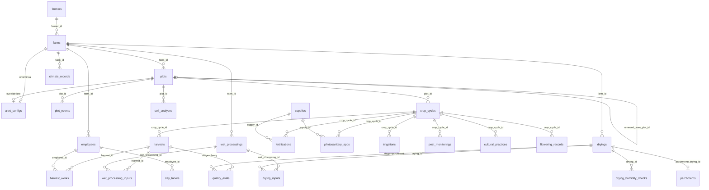

# Farm Operations — Modelo de Datos

> Documento 2 de la hoja de ruta ([arquitectura.md](arquitectura.md) §12).
> Estado: **✅ aprobado** (2026-08-06) — sin código ni migraciones aún.
> Última actualización: 2026-08-06

---

## 1. Convenciones

Heredadas de los modelos existentes (`Process`, `Fair`, `Parchment`):

| Convención | Regla |
|---|---|
| PK | `id Integer autoincrement` en todas las tablas. |
| Nombres | Tablas en inglés, plural, `snake_case`. Modelos en singular `PascalCase`. |
| Pesos (kg) | `Numeric(10, 3)`. |
| Dinero (COP) | `Numeric(12, 2)`. |
| Porcentajes | `Numeric(5, 2)` (0–100). |
| Enums | `enum.Enum` de Python + `Enum` de SQLAlchemy (patrón `FairStatusEnum`). |
| Fechas | `Date` para fechas de negocio; `DateTime(timezone=True)` para instantes. |
| Timestamps | Todas las tablas nuevas llevan `created_at DateTime(timezone=True) server_default=now()`. |
| Observaciones | `Text nullable` en toda tabla operativa. |
| Borrado | `ondelete="RESTRICT"` en toda la cadena de trazabilidad (regla §6 de arquitectura). `CASCADE` solo en detalles sin valor propio (pivotes, logs). |
| Índices | Sobre toda FK consultada y fechas de filtrado, prefijo `idx_`. |

**Nota de nombres**: el beneficio se llama `WetProcessing` (tabla
`wet_processings`) y no `Processing`, para no colisionar con el `Process`
existente (maquila/trilla). Ver §9 punto R1.

## 2. Diagrama ER



## 3. Tablas nuevas

### 3.1 `farms` — Fincas

| Columna | Tipo | Constraints | Descripción |
|---|---|---|---|
| id | Integer | PK | |
| farmer_id | Integer | FK `farmers.id` RESTRICT, NOT NULL | El farmer se crea primero (C4). |
| name | String(100) | NOT NULL | |
| village | String(255) | NOT NULL | Vereda. |
| municipality | String(255) | NOT NULL | |
| altitude | Numeric(6,2) | NULL | m s.n.m. (misma precisión que `parchments.altitude`). |
| total_area | Numeric(8,2) | NULL | Hectáreas. |
| latitude | Numeric(9,6) | NULL | Opcional, para mapas futuros. |
| longitude | Numeric(9,6) | NULL | Opcional, para mapas futuros. |
| active | Boolean | NOT NULL, default true | |
| observations | Text | NULL | |
| created_at | DateTime(tz) | NOT NULL, default now() | |

Índices: `idx_farm_farmer_id`.
Unicidad: `(farmer_id, name)` única.

> `Farmer.farm_name/village/municipality` existentes quedan como datos del
> farmer proveedor (no se migran ni se borran en v1); las fincas gestionadas
> viven aquí.

### 3.2 `plots` — Lotes (terreno + su única siembra)

| Columna | Tipo | Constraints | Descripción |
|---|---|---|---|
| id | Integer | PK | |
| farm_id | Integer | FK `farms.id` RESTRICT, NOT NULL | |
| name | String(100) | NOT NULL | |
| status | Enum `PlotStatusEnum` | NOT NULL, default `active` | `active` / `closed`. Cierre definitivo (D2). |
| renewed_from_plot_id | Integer | FK `plots.id` RESTRICT, NULL | Lote anterior sobre el mismo terreno (D2). |
| area | Numeric(8,2) | NULL | Hectáreas. |
| slope | Numeric(5,2) | NULL | % de pendiente. |
| soil_type | String(100) | NULL | Franco, arcilloso, arenoso… |
| location | String(255) | NULL | Ubicación/referencia dentro de la finca. |
| **Siembra** | | | |
| variety | String(100) | NOT NULL | Sale de la semilla (D6). |
| planting_date | Date | NULL | |
| initial_age_years | Numeric(4,1) | NULL | Edad al registrar un cultivo ya establecido (D2). |
| seedling_count | Integer | NULL | Cantidad de plántulas. |
| row_spacing_m | Numeric(4,2) | NULL | Distancia entre surcos (m). |
| plant_spacing_m | Numeric(4,2) | NULL | Distancia entre plantas (m). |
| shade_type | String(100) | NULL | Tipo de sombrío (guamo, plátano, libre exposición…). |
| **Procedencia de la semilla (D6)** | | | |
| seed_supplier | String(255) | NULL | Proveedor / almacén / germinador propio. |
| seed_origin_place | String(255) | NULL | Dónde se compró u obtuvo. |
| seed_purchase_date | Date | NULL | |
| seed_cost | Numeric(12,2) | NULL | |
| **Cierre** | | | |
| closed_at | Date | NULL | |
| observations | Text | NULL | |
| created_at | DateTime(tz) | NOT NULL, default now() | |

Constraints:
- `CHECK (planting_date IS NOT NULL OR initial_age_years IS NOT NULL)` — toda
  siembra tiene fecha o edad estimada.
- `CHECK (status != 'closed' OR closed_at IS NOT NULL)`.
- Unicidad: `(farm_id, name)` única **entre lotes activos** (índice parcial:
  el nombre puede reutilizarse tras cerrar el lote y resembrar).

Índices: `idx_plot_farm_id`, `idx_plot_status`.

### 3.3 `plot_events` — Eventos del lote

| Columna | Tipo | Constraints | Descripción |
|---|---|---|---|
| id | Integer | PK | |
| plot_id | Integer | FK `plots.id` RESTRICT, NOT NULL | |
| event_type | Enum `PlotEventTypeEnum` | NOT NULL | `zoca`, `partial_replant`, `shade_change`, `closure`, `reopening`, `other`. |
| other_detail | String(150) | NULL | Cuál evento, cuando `event_type = other` (obligatorio en servicio). |
| event_date | Date | NOT NULL | |
| description | Text | NULL | |
| created_at | DateTime(tz) | NOT NULL, default now() | |

Índices: `idx_plot_event_plot_id`, `idx_plot_event_date`.
La edad efectiva del cultivo = `event_date` de la última `zoca`, o
`planting_date`/`initial_age_years` si no hay zocas.

### 3.4 `alert_configs` — Configuración de alertas (dos niveles, G1)

Una fila por finca **o** por lote. Toda columna de parámetro es `NULL` =
"heredar del nivel superior". Resolución: lote → finca → default del sistema
(constantes de literatura definidas en código, doc 5 de la hoja de ruta).

| Columna | Tipo | Constraints | Descripción |
|---|---|---|---|
| id | Integer | PK | |
| farm_id | Integer | FK `farms.id` CASCADE, NULL, UNIQUE | Nivel finca. |
| plot_id | Integer | FK `plots.id` CASCADE, NULL, UNIQUE | Nivel lote (override). |
| fertilization_reminder_days | Integer | NULL | Cada cuántos días recordar fertilización. |
| irrigation_reminder_days | Integer | NULL | |
| phytosanitary_reminder_days | Integer | NULL | |
| weeding_reminder_days | Integer | NULL | Deshierba/plateo. |
| harvest_reminder_days | Integer | NULL | Próxima pasada. |
| inactivity_alert_days | Integer | NULL | Ciclo activo sin registros. |
| max_drying_days | Integer | NULL | Secado abierto demasiado tiempo. |
| min_final_humidity | Numeric(5,2) | NULL | Default sistema: 10 %. |
| max_final_humidity | Numeric(5,2) | NULL | Default sistema: 12 %. |
| min_fermentation_hours | Integer | NULL | |
| max_fermentation_hours | Integer | NULL | |
| broca_alert_pct | Numeric(5,2) | NULL | Umbral de % de infestación del último muestreo (`pest_monitorings.broca_pct`) que dispara la alerta. Default sistema: 2 % (umbral de daño económico, Cenicafé). Cómo se mide: ver nota en §3.8. |
| created_at | DateTime(tz) | NOT NULL, default now() | |

Constraint: `CHECK ((farm_id IS NULL) != (plot_id IS NULL))` — exactamente un
nivel por fila.

> Las alertas **solo notifican**, nunca bloquean (principio §7.2 de
> arquitectura). Esta tabla no impone ninguna acción.

### 3.5 `crop_cycles` — Ciclos productivos

| Columna | Tipo | Constraints | Descripción |
|---|---|---|---|
| id | Integer | PK | |
| plot_id | Integer | FK `plots.id` RESTRICT, NOT NULL | |
| cycle_number | Integer | NOT NULL | Número legible del ciclo dentro del lote (1, 2, 3…), asignado por el servicio (`max + 1`). Sirve para: identificar el ciclo en la UI y reportes («Ciclo 3 — lote La Loma»), dar orden cronológico estable sin depender del `id` global, y comparar «ciclo N» entre lotes en el dashboard/ML. Único por lote. |
| start_date | Date | NOT NULL | |
| end_date | Date | NULL | Se llena al cerrar (fin de la cosecha del ciclo). |
| status | Enum `CycleStatusEnum` | NOT NULL, default `active` | `active` / `closed`. |
| observations | Text | NULL | |
| created_at | DateTime(tz) | NOT NULL, default now() | |

Constraints:
- Unicidad `(plot_id, cycle_number)`.
- Índice parcial único: **un solo ciclo `active` por lote**.
- `CHECK (end_date IS NULL OR end_date >= start_date)`.

### 3.6 `climate_records` — Registros climáticos manuales

| Columna | Tipo | Constraints | Descripción |
|---|---|---|---|
| id | Integer | PK | |
| farm_id | Integer | FK `farms.id` RESTRICT, NOT NULL | |
| plot_id | Integer | FK `plots.id` RESTRICT, NULL | Opcional: si es NULL aplica a toda la finca. |
| record_date | Date | NOT NULL | |
| rainfall_mm | Numeric(6,1) | NULL | |
| temp_min_c | Numeric(4,1) | NULL | Temperatura mínima del día (°C). |
| temp_max_c | Numeric(4,1) | NULL | Temperatura máxima del día (°C). |
| observations | Text | NULL | Granizada, vendaval, helada… |
| created_at | DateTime(tz) | NOT NULL, default now() | |

Índices: `idx_climate_farm_date (farm_id, record_date)`.
El clima se asocia a los ciclos **por rango de fechas** en la consulta (no por
FK): un registro de finca aplica a todos sus lotes activos ese día.

### 3.7 `supplies` — Catálogo de insumos (D7)

Catálogo **global** (compartido entre fincas — los insumos comerciales son
universales; no contiene datos personales).

| Columna | Tipo | Constraints | Descripción |
|---|---|---|---|
| id | Integer | PK | |
| name | String(150) | NOT NULL | Urea, DAP, Lorsban… |
| supply_type | Enum `SupplyTypeEnum` | NOT NULL | `fertilizer`, `phytosanitary`, `herbicide`, `amendment`, `other`. |
| other_detail | String(150) | NULL | Qué tipo de insumo, cuando `supply_type = other` (obligatorio en servicio). |
| unit | String(20) | NOT NULL, default `kg` | kg, L, g, cc. |
| composition | String(255) | NULL | Ingrediente activo / grado (ej. 25-4-24). |
| active | Boolean | NOT NULL, default true | Ocultar sin borrar (los registros históricos lo referencian). |
| created_at | DateTime(tz) | NOT NULL, default now() | |

Unicidad: `(name, supply_type)`.

### 3.8 Labores del ciclo

Todas las tablas de labores se relacionan con su ciclo mediante la columna
explícita `crop_cycle_id` (FK `crop_cycles.id` RESTRICT, NOT NULL) — excepto
`soil_analyses`, que cuelga de `plot_id` (R6). Índice compuesto
`(crop_cycle_id, fecha)` en cada una.

**`fertilizations`**

| Columna | Tipo | Constraints | Descripción |
|---|---|---|---|
| id | Integer | PK | |
| crop_cycle_id | Integer | FK `crop_cycles.id` RESTRICT, NOT NULL | Ciclo al que pertenece la labor. |
| supply_id | Integer | FK `supplies.id` RESTRICT, NOT NULL | Insumo aplicado. |
| application_date | Date | NOT NULL | |
| method | Enum `FertilizationMethodEnum` | NOT NULL | `soil` (edáfica) / `foliar`. |
| quantity | Numeric(10,3) | NOT NULL | En la unidad del insumo (total aplicado al lote). |
| dose_per_tree_g | Numeric(8,2) | NULL | Dosis por árbol (g). |
| cost | Numeric(12,2) | NULL | Costo del insumo aplicado. |
| observations | Text | NULL | |
| created_at | DateTime(tz) | NOT NULL, default now() | |

**`phytosanitary_apps`**

| Columna | Tipo | Constraints | Descripción |
|---|---|---|---|
| id | Integer | PK | |
| crop_cycle_id | Integer | FK `crop_cycles.id` RESTRICT, NOT NULL | |
| supply_id | Integer | FK `supplies.id` RESTRICT, NOT NULL | |
| application_date | Date | NOT NULL | |
| target | String(100) | NOT NULL | broca, roya, maleza, cochinilla… |
| quantity | Numeric(10,3) | NOT NULL | En la unidad del insumo. |
| dose_description | String(255) | NULL | "20 cc por bomba de 20 L". |
| cost | Numeric(12,2) | NULL | |
| observations | Text | NULL | |
| created_at | DateTime(tz) | NOT NULL, default now() | |

**`irrigations`**

| Columna | Tipo | Constraints | Descripción |
|---|---|---|---|
| id | Integer | PK | |
| crop_cycle_id | Integer | FK `crop_cycles.id` RESTRICT, NOT NULL | |
| irrigation_date | Date | NOT NULL | |
| method | String(100) | NULL | Aspersión, goteo, manguera… |
| duration_minutes | Integer | NULL | |
| volume_liters | Numeric(10,1) | NULL | |
| observations | Text | NULL | |
| created_at | DateTime(tz) | NOT NULL, default now() | |

**`pest_monitorings`** (muestreos de plagas/enfermedades)

| Columna | Tipo | Constraints | Descripción |
|---|---|---|---|
| id | Integer | PK | |
| crop_cycle_id | Integer | FK `crop_cycles.id` RESTRICT, NOT NULL | |
| monitoring_date | Date | NOT NULL | |
| broca_pct | Numeric(5,2) | NULL | % infestación de broca (ver nota de muestreo abajo). |
| roya_pct | Numeric(5,2) | NULL | % incidencia de roya (árboles con síntomas / árboles evaluados). |
| other_pest | String(100) | NULL | Cochinilla, minador, mal rosado… |
| other_pest_pct | Numeric(5,2) | NULL | |
| severity | Enum `SeverityEnum` | NULL | `low` / `medium` / `high`. |
| observations | Text | NULL | |
| created_at | DateTime(tz) | NOT NULL, default now() | |

> **Cómo se mide el % de broca (método Cenicafé simplificado):** se recorren
> ~30 árboles distribuidos en zigzag por el lote; en cada árbol se toma una
> rama del tercio medio y se cuentan ~100 frutos, revisando cuántos tienen la
> perforación característica en la corona. `broca_pct` = frutos perforados ÷
> frutos revisados × 100. El sistema solo pide el resultado (el usuario puede
> anotar el conteo en `observations`). **La alerta**: si el `broca_pct` del
> último muestreo del ciclo ≥ `broca_alert_pct` resuelto (lote → finca →
> default 2 %), el dashboard muestra "Broca por encima del umbral en lote X —
> considerar renovar el monitoreo o aplicar control". Solo informa, no obliga
> (§7.2 de arquitectura).

**`cultural_practices`**

| Columna | Tipo | Constraints | Descripción |
|---|---|---|---|
| id | Integer | PK | |
| crop_cycle_id | Integer | FK `crop_cycles.id` RESTRICT, NOT NULL | |
| practice_type | Enum `CulturalPracticeTypeEnum` | NOT NULL | `weeding` (deshierba/plateo), `pruning` (poda), `shade_regulation`, `amendment` (encalado), `other`. |
| other_detail | String(150) | NULL | Cuál labor, cuando `practice_type = other` (obligatorio en servicio). |
| practice_date | Date | NOT NULL | |
| cost | Numeric(12,2) | NULL | |
| observations | Text | NULL | |
| created_at | DateTime(tz) | NOT NULL, default now() | |

**`flowering_records`**

| Columna | Tipo | Constraints | Descripción |
|---|---|---|---|
| id | Integer | PK | |
| crop_cycle_id | Integer | FK `crop_cycles.id` RESTRICT, NOT NULL | |
| flowering_date | Date | NOT NULL | |
| intensity | Enum `IntensityEnum` | NOT NULL | `low` / `medium` / `high`. Proyección de cosecha ≈ +32 semanas. |
| observations | Text | NULL | |
| created_at | DateTime(tz) | NOT NULL, default now() | |

**`soil_analyses`** (cuelga de `plot_id`, no del ciclo — el suelo es del
terreno; se asocia a ciclos por fecha)

| Columna | Tipo | Constraints | Descripción |
|---|---|---|---|
| id | Integer | PK | |
| plot_id | Integer | FK `plots.id` RESTRICT, NOT NULL | |
| analysis_date | Date | NOT NULL | |
| ph | Numeric(4,2) | NULL | |
| organic_matter_pct | Numeric(5,2) | NULL | |
| nitrogen | Numeric(8,2) | NULL | ppm o meq según laboratorio. |
| phosphorus | Numeric(8,2) | NULL | ppm o meq según laboratorio. |
| potassium | Numeric(8,2) | NULL | ppm o meq según laboratorio. |
| texture | String(100) | NULL | |
| laboratory | String(150) | NULL | |
| observations | Text | NULL | |
| created_at | DateTime(tz) | NOT NULL, default now() | |

### 3.9 `employees` — Trabajadores de finca

Independiente de `persons`: los recolectores suelen ser informales y no deben
chocar con las restricciones únicas de `persons` (ver §9 punto R3).

| Columna | Tipo | Constraints | Descripción |
|---|---|---|---|
| id | Integer | PK | |
| farm_id | Integer | FK `farms.id` RESTRICT, NOT NULL | |
| full_name | String(255) | NOT NULL | |
| document | String(50) | NULL | |
| phone | String(20) | NULL | |
| active | Boolean | NOT NULL, default true | |
| observations | Text | NULL | |
| created_at | DateTime(tz) | NOT NULL, default now() | |

### 3.10 `harvests` — Cosechas (sesión, análoga a `fairs`)

| Columna | Tipo | Constraints | Descripción |
|---|---|---|---|
| id | Integer | PK | |
| crop_cycle_id | Integer | FK `crop_cycles.id` RESTRICT, NOT NULL | |
| pass_number | Integer | NOT NULL | Pasada 1ª, 2ª… único por ciclo. |
| start_date | Date | NOT NULL | |
| end_date | Date | NULL | |
| status | Enum `HarvestStatusEnum` | NOT NULL, default `open` | `open` / `closed`. |
| rate_per_kg | Numeric(12,2) | NULL | Tarifa default de la sesión por kg recogido. |
| rate_per_day | Numeric(12,2) | NULL | Valor default del jornal diario (ej. $60.000), para trabajos pagados por día. |
| total_cherry_kg | Numeric(10,3) | NULL | Al cerrar: suma de `harvest_works` + recolección familiar no paga (editable). |
| observations | Text | NULL | |
| created_at | DateTime(tz) | NOT NULL, default now() | |

Unicidad: `(crop_cycle_id, pass_number)`.
La **composición** (% maduros, % verdes, % brocados…) NO vive aquí sino en
`quality_evals` con `stage='cherry'` — una sola fuente de verdad (§9 punto R2).

### 3.11 `harvest_works` — Recolección diaria por empleado

| Columna | Tipo | Constraints | Descripción |
|---|---|---|---|
| id | Integer | PK | |
| harvest_id | Integer | FK `harvests.id` CASCADE, NOT NULL | Detalle de la sesión. |
| employee_id | Integer | FK `employees.id` RESTRICT, NOT NULL | |
| work_date | Date | NOT NULL | |
| payment_type | Enum `HarvestPaymentTypeEnum` | NOT NULL, default `per_kg` | `per_kg` (al peso) / `per_day` (jornal fijo del día). |
| kg_collected | Numeric(10,3) | NULL | Obligatorio si `per_kg`. Opcional si `per_day` (registrarlo igual alimenta el total de la cosecha). |
| rate_per_kg | Numeric(12,2) | NULL | Obligatorio si `per_kg`. Copia de la tarifa vigente (puede variar por día/persona). |
| day_value | Numeric(12,2) | NULL | Obligatorio si `per_day`: valor del jornal (ej. $60.000). |
| total_value | Numeric(12,2) | NOT NULL | Calculado en servicio y almacenado: `kg_collected × rate_per_kg` si `per_kg`; `day_value` si `per_day`. |
| paid | Boolean | NOT NULL, default false | |
| paid_at | Date | NULL | |
| created_at | DateTime(tz) | NOT NULL, default now() | |

Constraint:
`CHECK ((payment_type = 'per_kg' AND kg_collected IS NOT NULL AND rate_per_kg IS NOT NULL) OR (payment_type = 'per_day' AND day_value IS NOT NULL))`.

Índices: `idx_hwork_harvest_date (harvest_id, work_date)`, `idx_hwork_employee_id`.

### 3.12 `day_labors` — Jornales (labores no-cosecha)

| Columna | Tipo | Constraints | Descripción |
|---|---|---|---|
| id | Integer | PK | |
| employee_id | Integer | FK `employees.id` RESTRICT, NOT NULL | |
| labor_date | Date | NOT NULL | |
| activity_type | Enum `LaborActivityEnum` | NOT NULL | `weeding`, `pruning`, `fertilization`, `phytosanitary`, `irrigation`, `shade_regulation`, `maintenance`, `other`. |
| other_detail | String(150) | NULL | Cuál actividad, cuando `activity_type = other` (obligatorio en servicio). |
| plot_id | Integer | FK `plots.id` RESTRICT, NULL | Opcional: en qué lote trabajó. |
| daily_value | Numeric(12,2) | NOT NULL | Valor del jornal. |
| paid | Boolean | NOT NULL, default false | |
| paid_at | Date | NULL | |
| observations | Text | NULL | |
| created_at | DateTime(tz) | NOT NULL, default now() | |

### 3.13 `quality_evals` — Evaluación de calidad (D5, una tabla con `stage`)

| Columna | Tipo | Constraints | Descripción |
|---|---|---|---|
| id | Integer | PK | |
| stage | Enum `QualityStageEnum` | NOT NULL | `cherry` / `parchment`. |
| harvest_id | Integer | FK `harvests.id` RESTRICT, NULL | Obligatorio si `cherry`. |
| drying_id | Integer | FK `dryings.id` RESTRICT, NULL | Obligatorio si `parchment`. |
| eval_date | Date | NOT NULL | |
| **Etapa cereza** | | | |
| ripe_pct | Numeric(5,2) | NULL | % maduros/rojos. |
| green_pct | Numeric(5,2) | NULL | % verdes. |
| overripe_pct | Numeric(5,2) | NULL | % sobremaduros/secos. |
| bored_pct | Numeric(5,2) | NULL | % brocados (aplica a ambas etapas). |
| **Etapa pergamino** | | | |
| humidity_pct | Numeric(5,2) | NULL | 10–12 % esperado. |
| defects_pct | Numeric(5,2) | NULL | % defectos / (100 − almendra sana). |
| yield_factor | Numeric(6,2) | NULL | Factor de rendimiento en trilla. |
| score | Numeric(5,2) | NULL | Puntaje 0–100 estilo SCA. |
| observations | Text | NULL | |
| created_at | DateTime(tz) | NOT NULL, default now() | |

Constraints:
- `CHECK ((stage = 'cherry' AND harvest_id IS NOT NULL AND drying_id IS NULL) OR (stage = 'parchment' AND drying_id IS NOT NULL AND harvest_id IS NULL))`.
- `CHECK (score IS NULL OR (score >= 0 AND score <= 100))` y rangos 0–100 en
  todos los porcentajes.

Extensión futura: tabla satélite `cupping_details` 1:1 si llega catación
formal por atributos (arquitectura §5.1).

### 3.14 `wet_processings` — Beneficio (etapas 1–4 de §5.2 de arquitectura)

| Columna | Tipo | Constraints | Descripción |
|---|---|---|---|
| id | Integer | PK | |
| farm_id | Integer | FK `farms.id` RESTRICT, NOT NULL | Redundante con las cosechas de la pivote, pero necesaria para filtrar por permiso y para mezclas (validación: todas las cosechas de la pivote pertenecen a la finca). |
| status | Enum `WetProcessingStatusEnum` | NOT NULL, default `in_progress` | `in_progress` / `completed`. |
| **1. Selección de flotes** | | | |
| floats_kg | Numeric(10,3) | NULL | kg de flotes retirados. |
| floats_method | String(100) | NULL | Tanque, zaranda… |
| **2. Despulpado** | | | |
| pulped_at | DateTime(tz) | NULL | Fecha y hora de despulpado. Horas desde recolección = calculado vs fechas de `harvest_works`. |
| **3. Fermentación** | | | |
| fermentation_start | DateTime(tz) | NULL | |
| fermentation_end | DateTime(tz) | NULL | Horas totales = calculado. |
| fermentation_method | Enum `FermentationMethodEnum` | NULL | `tank` (tanque), `dry` (seco), `water` (con agua), `other`. |
| fermentation_other_detail | String(150) | NULL | Cuál método, cuando `fermentation_method = other` (obligatorio en servicio). |
| fermentation_decided_by | String(150) | NULL | Fermaestro: quién indicó el punto de lavado. |
| fermentation_criteria | String(255) | NULL | Prueba de tacto, palote, pH… |
| ambient_temp_c | Numeric(4,1) | NULL | |
| **4. Lavado** | | | |
| wash_count | Integer | NULL | Nº de lavadas/aguas. |
| washed_kg | Numeric(10,3) | NULL | kg de café lavado que salen a secado. |
| observations | Text | NULL | |
| created_at | DateTime(tz) | NOT NULL, default now() | |

kg de cereza que entran = `SUM(wet_processing_inputs.cherry_kg)` (calculado).

Constraint: `CHECK (fermentation_end IS NULL OR fermentation_start IS NOT NULL)`.

### 3.15 `wet_processing_inputs` — Pivote cosechas → beneficio (D3)

| Columna | Tipo | Constraints | Descripción |
|---|---|---|---|
| id | Integer | PK | |
| wet_processing_id | Integer | FK `wet_processings.id` CASCADE, NOT NULL | |
| harvest_id | Integer | FK `harvests.id` RESTRICT, NOT NULL | |
| cherry_kg | Numeric(10,3) | NOT NULL, CHECK > 0 | kg que esta cosecha aporta a este beneficio. |

Unicidad: `(wet_processing_id, harvest_id)`.
Validación de servicio: la suma de aportes de una cosecha entre todos sus
beneficios no supera su `total_cherry_kg`.

### 3.16 `dryings` — Secado y almacenamiento (etapas 5–6 de §5.2)

| Columna | Tipo | Constraints | Descripción |
|---|---|---|---|
| id | Integer | PK | |
| farm_id | Integer | FK `farms.id` RESTRICT, NOT NULL | |
| status | Enum `DryingStatusEnum` | NOT NULL, default `in_progress` | `in_progress` / `completed`. |
| method | Enum `DryingMethodEnum` | NOT NULL | `elba`, `marquesina` (parabólico), `patio`, `mechanical_silo`, `other`. |
| other_detail | String(150) | NULL | Cuál método, cuando `method = other` (carpa, camilla…; obligatorio en servicio). |
| start_date | Date | NOT NULL | |
| end_date | Date | NULL | Días de secado = calculado. |
| final_humidity_pct | Numeric(5,2) | NULL | Obligatoria en servicio al completar (10–12 % esperado, solo alerta). |
| output_kg | Numeric(10,3) | NULL | kg de pergamino seco. Obligatoria en servicio al completar. |
| **Almacenamiento (al cierre)** | | | |
| packaging | String(150) | NULL | Default UI: "bolsa GrainPro + costal de fique". |
| sack_count | Integer | NULL | Nº de bultos. |
| packed_at | Date | NULL | |
| storage_place | String(150) | NULL | Bodega/lugar en finca. |
| destination | Enum `DryingDestinationEnum` | NULL | `inventory` (crea `Parchment`), `direct_sale`, `stored` (queda en finca; puede pasar a inventario después). |
| observations | Text | NULL | |
| created_at | DateTime(tz) | NOT NULL, default now() | |

kg húmedos que entran = `SUM(drying_inputs.wet_kg)`.
Rendimiento cereza → pergamino = `output_kg / Σ cereza trazada` (F2, calculado).

**`drying_humidity_checks`** (mediciones intermedias opcionales)

| Columna | Tipo | Descripción |
|---|---|---|
| drying_id | Integer FK `dryings.id` CASCADE NOT NULL | |
| check_date | Date NOT NULL | |
| humidity_pct | Numeric(5,2) NOT NULL | |

### 3.17 `drying_inputs` — Pivote beneficios → secado (D3)

| Columna | Tipo | Constraints | Descripción |
|---|---|---|---|
| id | Integer | PK | |
| drying_id | Integer | FK `dryings.id` CASCADE, NOT NULL | |
| wet_processing_id | Integer | FK `wet_processings.id` RESTRICT, NOT NULL | |
| wet_kg | Numeric(10,3) | NOT NULL, CHECK > 0 | kg de café lavado aportados. |

Unicidad: `(drying_id, wet_processing_id)`.

## 4. Cambios a tablas existentes

| Tabla | Cambio | Detalle |
|---|---|---|
| `parchments` | **Nueva columna** `drying_id Integer FK dryings.id RESTRICT NULL UNIQUE` | El eslabón de trazabilidad (C2). NULL = café comprado a terceros. UNIQUE: un secado genera máximo un registro de pergamino. |
| `parchments` | `origin_batch` **se conserva** como `String(100)` | Sigue siendo el texto libre para café comprado (código de lote del caficultor) y para los datos históricos ya importados. La trazabilidad real va por `drying_id`. Ver §9 punto R4. |
| `users` | Nuevo valor de rol: `farmer` | Sin cambio de schema (columna `String`). |
| — | Sin más cambios | `purchase_price`/`full_price` intactos (C1): el productor asigna `full_price` y el servicio actual calcula `purchase_price`. |

## 5. Enums (resumen)

| Enum | Valores |
|---|---|
| `PlotStatusEnum` | `active`, `closed` |
| `PlotEventTypeEnum` | `zoca`, `partial_replant`, `shade_change`, `closure`, `reopening`, `other` |
| `CycleStatusEnum` | `active`, `closed` |
| `SupplyTypeEnum` | `fertilizer`, `phytosanitary`, `herbicide`, `amendment`, `other` |
| `FertilizationMethodEnum` | `soil`, `foliar` |
| `SeverityEnum` / `IntensityEnum` | `low`, `medium`, `high` |
| `CulturalPracticeTypeEnum` | `weeding`, `pruning`, `shade_regulation`, `amendment`, `other` |
| `HarvestStatusEnum` | `open`, `closed` |
| `HarvestPaymentTypeEnum` | `per_kg`, `per_day` |
| `LaborActivityEnum` | `weeding`, `pruning`, `fertilization`, `phytosanitary`, `irrigation`, `shade_regulation`, `maintenance`, `other` |
| `QualityStageEnum` | `cherry`, `parchment` |
| `WetProcessingStatusEnum` | `in_progress`, `completed` |
| `FermentationMethodEnum` | `tank`, `dry`, `water`, `other` |
| `DryingStatusEnum` | `in_progress`, `completed` |
| `DryingMethodEnum` | `elba`, `marquesina`, `patio`, `mechanical_silo`, `other` |
| `DryingDestinationEnum` | `inventory`, `direct_sale`, `stored` |

**Regla transversal**: toda tabla cuyo enum admite el valor `other` lleva un
campo `other_detail String(150)` (en `wet_processings`,
`fermentation_other_detail`) para especificar cuál; el servicio lo exige
cuando se elige `other`. `pest_monitorings` ya lo cubre con `other_pest`.

## 6. Reglas de integridad transversales

1. **Cadena de trazabilidad**: `RESTRICT` en todas las FKs de la cadena
   (plots → crop_cycles → harvests → wet_processing_inputs → dryings →
   parchments). Solo los detalles sin valor propio usan `CASCADE`
   (`harvest_works`, pivotes desde su cabecera, `drying_humidity_checks`,
   `alert_configs`).
2. **Un ciclo activo por lote** (índice parcial único).
3. **Balance de masas (servicio, no constraint)**: al asociar cosechas a un
   beneficio, la suma de `cherry_kg` repartida no puede exceder el
   `total_cherry_kg` de la cosecha; igual para `wet_kg` vs `washed_kg` del
   beneficio.
4. **Cierre de secado con destino `inventory`** = transacción única que crea
   `Inventory` + `Parchment` (con `drying_id`, `farmer_id` de la finca,
   `full_price` asignado por el productor, `purchase_price` calculado por el
   servicio actual) y marca el secado `completed`.
5. **Lote cerrado**: el servicio impide abrir ciclos sobre `plots.status =
   'closed'`; la reapertura es una operación explícita de corrección que
   registra un `plot_event` tipo `reopening`.
6. **Permisos**: toda query del módulo parte de
   `farms.farmer_id → farmer.person_id = current_user.person_id` salvo rol
   `admin` (E3).

## 7. Trazabilidad completa (cadena final con nombres de tablas)

```
sales → detail_sales → inventories → parchments
    parchments.drying_id → dryings
    dryings ← drying_inputs → wet_processings
    wet_processings ← wet_processing_inputs → harvests
    harvests.crop_cycle_id → crop_cycles
    crop_cycles.plot_id → plots
    plots.farm_id → farms
    farms.farmer_id → farmers → persons (→ users)
```

## 8. Orden de migraciones previsto

1. Catálogos y base: `supplies`, `farms`, `plots`, `plot_events`,
   `alert_configs`, `employees`.
2. Ciclo y labores: `crop_cycles`, `climate_records`, `fertilizations`,
   `phytosanitary_apps`, `irrigations`, `pest_monitorings`,
   `cultural_practices`, `flowering_records`, `soil_analyses`.
3. Cosecha y nómina: `harvests`, `harvest_works`, `day_labors`.
4. Proceso: `wet_processings`, `wet_processing_inputs`, `dryings`,
   `drying_inputs`, `drying_humidity_checks`, `quality_evals`.
5. Integración: `parchments.drying_id` + datos semilla (farmer **Shaya** con
   su `Person`; defaults de `supplies` comunes opcionales).

## 9. Decisiones de este documento — ✅ validadas por el usuario (2026-08-06)

| # | Decisión | Alternativa descartada |
|---|---|---|
| R1 | El beneficio se llama **`WetProcessing`** (`wet_processings`) | `Processing` colisiona conceptualmente con el `Process` existente (maquila). Si prefieres otro nombre (`Benefit`, `WetMill`), es solo renombrar. |
| R2 | La **composición de la cosecha** (% maduros, verdes, brocados) vive solo en `quality_evals(stage='cherry')`, no duplicada en `harvests` | Tenerla en ambas tablas crea dos fuentes de verdad. La UI puede mostrar el formulario de composición dentro de la pantalla de cosecha, pero escribe en `quality_evals`. |
| R3 | `employees` es **independiente de `persons`** | Reusar `Person` obligaría documento/email únicos y mezclaría recolectores informales con el eje de identidad del sistema (users/farmers/customers). Si un empleado llega a necesitar cuenta, se crea su `Person` en ese momento. |
| R4 | `origin_batch` **se conserva** como texto libre para café comprado; la trazabilidad real va por la nueva `parchments.drying_id` | Convertir `origin_batch` en FK rompería los datos históricos importados de Excel y quitaría el campo de código de lote para compras a terceros. |
| R5 | El clima se asocia a ciclos **por rango de fechas**, no por FK a `crop_cycles` | FK al ciclo obligaría a duplicar el registro de lluvia en cada lote activo; por fecha, un registro de finca cubre todos sus lotes. |
| R6 | `soil_analyses` cuelga de `plots`, no de `crop_cycles` | El suelo es del terreno, no del ciclo; se asocia al ciclo por fecha. (Desvío menor respecto al ER conceptual de arquitectura). |
| R7 | `harvest_works.rate_per_kg` se **copia** en cada registro diario | Solo la tarifa en `harvests` impediría tarifas distintas por día o por persona, y una edición posterior reescribiría pagos ya hechos. |
| R8 | `dryings.destination = stored` permite café que queda guardado en finca y entra a inventario después | Sin ese estado, todo secado tendría que salir a inventario o venta inmediatamente al cerrarse. |
